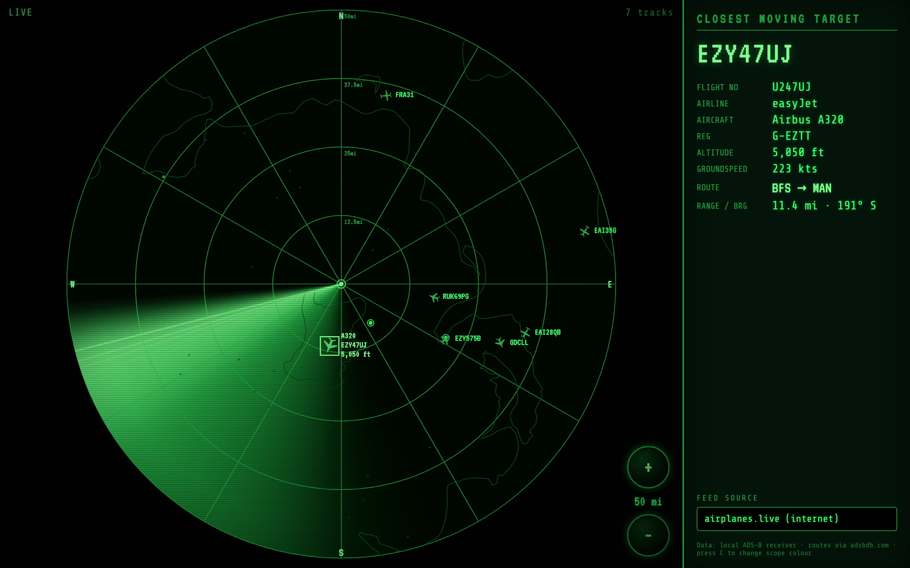

# Radar View

An animated, retro green‑phosphor **radar scope** that plots live aircraft flying overhead,
fed by a local PiAware / SkyAware (dump1090‑fa) ADS‑B receiver.



The closest aircraft to your receiver is locked and its details are shown:
**callsign, flight number, airline, aircraft type, registration, altitude, groundspeed,
departure → arrival (3‑letter IATA), range & bearing.**

Features:

- Sweeping CRT beam, range rings, bearing spokes, phosphor trails, scanlines + vignette.
- **Type-aware aircraft icons** — distinct silhouettes for jets, turboprops, military aircraft
  and helicopters (with a legend in the panel), each rotated to its heading.
- Touch‑friendly **zoom +/−** buttons cycling `12.5 / 25 / 50 / 100 / 200` miles (default **50**).
- **Colour themes**: green, orange, blue — press **C** to cycle.
- Coastline + lakes outline (Natural Earth) and airports/airfields (OurAirports) drawn as dots in the radar style.
- Smooth motion via dead‑reckoning between the receiver's 1 Hz updates; stale targets dim out.

## Data sources

| What | Where |
|------|-------|
| Positions, altitude, groundspeed, track | `<device>/data/aircraft.json` |
| Receiver location | `<device>/data/receiver.json` |
| Aircraft type & registration | `<device>/db/…` (local SkyAware database) |
| Friendly aircraft names (e.g. `B789` → Boeing 787-9 Dreamliner) | `aircraft_types.json` (bundled ICAO Doc 8643 table) |
| Flight number, airline, dep/arr airports | `https://api.adsbdb.com` (public, CORS‑enabled) |

The radar page is **static** (`index.html`, `radar.css`, `radar.js`, `coastline.geojson`, `airports.json`, `aircraft_types.json`).
The only wrinkle is CORS: by default the ADS‑B device does **not** send an
`Access-Control-Allow-Origin` header, so a browser on another origin can't read its JSON.
There are two ways to solve that — pick **one**:

- **A. Run the bundled `serve.py` launcher** (no changes to the device). It serves the page and
  reverse‑proxies the device under `/adsb/*`. Easiest, recommended.
- **B. Enable CORS on the ADS‑B device** and point the page straight at it. Best for a
  permanent kiosk where you don't want a helper process. See
  [Enable CORS on the ADS‑B device](#enable-cors-on-the-ads-b-device).

By default `radar.js` uses `ADSB_BASE = "/adsb"` (works with option A). For option B, set the
device URL in `index.html` (instructions below).

---

## Feed sources (local vs internet)

The **FEED SOURCE** dropdown in the panel lets you switch the data feed live, without
reloading. Your choice is remembered in the browser (`localStorage`).

| Feed | What it is | Works out of the box? |
|------|-----------|------------------------|
| **local ADS‑B receiver** (default) | Your own PiAware/SkyAware device. Most detail (full local aircraft DB). | Yes — via `serve.py` proxy, or with CORS enabled on the device. |
| **airplanes.live** | Free community feed, no key. | Yes — it sends CORS headers, so it works even on a purely static host. |
| **adsb.lol** | Free community feed, no key. | Only via the `serve.py` proxy (it has no CORS header). Use the launcher. |
| **ADSBExchange (RapidAPI)** | Commercial feed. | Needs a [RapidAPI key](https://rapidapi.com/adsbx/api/adsbexchange-com1) — paste it into the **RapidAPI key** box that appears when selected. Routed via the `serve.py` proxy. |

Internet feeds query a radius around your **home location** (not the device's reported
position). Set your home coordinates in `index.html`:

```html
<script>window.RADAR_HOME = { lat: 54.76, lon: -6.35 };</script>
```

If you only ever use the local receiver, you can ignore this — it reads the location from
`data/receiver.json` automatically.

> **Note:** internet feeds cap the radius at 250 nm, so very large zoom levels are clamped.
> Community APIs are rate‑limited; the page polls about once per second.

---

## 1. Run locally (Mac / Windows / Linux)

Requires only Python 3 (bundled with macOS/Linux; on Windows install from python.org).

```bash
git clone <this-repo> radarview && cd radarview
python3 serve.py
```

Open <http://localhost:8000>. If your receiver isn't at `192.168.2.74:8080`, point at it:

```bash
python3 serve.py --device http://YOUR.PI.IP:8080
```

Useful flags: `--port 8000`, `--host 0.0.0.0` (expose to other devices on your LAN).

---

## 2. Install on a Raspberry Pi (Raspberry Pi OS, latest)

This runs the radar **full‑screen in a browser kiosk** on a Pi connected to a monitor/TV.
A Pi 3/4/5 (or even Pi Zero 2 W) is plenty. It can be the *same* Pi as your receiver or a
separate one.

### 2.1 Base setup

Flash the latest **Raspberry Pi OS (64‑bit, with Desktop)** with Raspberry Pi Imager, enabling
SSH and your Wi‑Fi/hostname in the imager's advanced options. Then SSH in and update:

```bash
sudo apt update && sudo apt full-upgrade -y
```

### 2.2 Get the radar files

```bash
sudo apt install -y git chromium-browser unclutter
git clone <this-repo> /home/pi/radarview
```

> On recent Raspberry Pi OS the browser package may be `chromium` instead of
> `chromium-browser`. Install whichever is available:
> `sudo apt install -y chromium || sudo apt install -y chromium-browser`.

### 2.3 Run the launcher as a service

Point `--device` at your receiver. If the radar Pi *is* the receiver, use `http://localhost:8080`.

```bash
sudo tee /etc/systemd/system/radarview.service >/dev/null <<'EOF'
[Unit]
Description=Radar View static server + ADS-B proxy
After=network-online.target
Wants=network-online.target

[Service]
User=pi
WorkingDirectory=/home/pi/radarview
ExecStart=/usr/bin/python3 /home/pi/radarview/serve.py --host 0.0.0.0 --port 8000 --device http://192.168.2.74:8080
Restart=always
RestartSec=3

[Install]
WantedBy=multi-user.target
EOF

sudo systemctl daemon-reload
sudo systemctl enable --now radarview.service
systemctl status radarview.service --no-pager
```

Check it works from another machine: `http://<pi-ip>:8000`.

---

## 3. Auto‑start the page full‑screen (kiosk) on the Pi

This launches Chromium in kiosk mode pointing at the local server every time the desktop starts.

Create a desktop autostart entry that waits for the server then opens the browser:

```bash
mkdir -p /home/pi/.config/autostart

# small wrapper that waits for the server, blanks the cursor, then opens kiosk Chromium
tee /home/pi/radarview/kiosk.sh >/dev/null <<'EOF'
#!/bin/bash
# wait until the local radar server answers
until curl -sf http://localhost:8000/ >/dev/null; do sleep 1; done

# stop the screen blanking / screensaver
xset s off; xset -dpms; xset s noblank
unclutter -idle 0.5 -root &

BROWSER=$(command -v chromium-browser || command -v chromium)
exec "$BROWSER" \
  --kiosk --noerrdialogs --disable-infobars --incognito \
  --check-for-update-interval=31536000 \
  --disable-pinch --overscroll-history-navigation=0 \
  http://localhost:8000/
EOF
chmod +x /home/pi/radarview/kiosk.sh

tee /home/pi/.config/autostart/radarview.desktop >/dev/null <<'EOF'
[Desktop Entry]
Type=Application
Name=Radar View Kiosk
Exec=/home/pi/radarview/kiosk.sh
X-GNOME-Autostart-enabled=true
EOF
```

Make sure the Pi boots to the **desktop with autologin**:

```bash
sudo raspi-config nonint do_boot_behaviour B4   # Desktop autologin
```

Reboot — the radar should appear full‑screen automatically:

```bash
sudo reboot
```

> **Wayland note (Pi 5 / latest OS default):** kiosk mode still works. If Chromium misbehaves,
> force X11 by setting **Advanced Options → Wayland → X11** in `sudo raspi-config`, then reboot.
> To exit kiosk mode, press **Alt+F4** or **Ctrl+W** (or SSH in and `sudo systemctl restart lightdm`).

> **Round / square displays (e.g. a 5″ 1080×1080 circular touch monitor):** when the viewport
> is roughly square the page auto‑switches to a round‑scope layout — the radar fills the whole
> screen (inscribed circle), the target readout becomes a translucent in‑scope HUD callout, and
> the **+ / −** zoom buttons move to the bottom‑centre next to the south pointer. No config needed.

---

## Enable CORS on the ADS‑B device

Only needed if you chose **option B** (page talks to the device directly, no `serve.py`).
SkyAware/dump1090‑fa serves via **lighttpd**. Add a tiny config snippet on the receiver Pi:

```bash
sudo tee /etc/lighttpd/conf-available/99-adsb-cors.conf >/dev/null <<'EOF'
# Allow browsers on other origins to read the ADS-B JSON + database
$HTTP["url"] =~ "^/(data|db|skyaware|dump1090-fa)/" {
    setenv.add-response-header += ( "Access-Control-Allow-Origin" => "*" )
}
EOF

sudo lighttpd-enable-mod adsb-cors 2>/dev/null || \
  sudo ln -sf /etc/lighttpd/conf-available/99-adsb-cors.conf /etc/lighttpd/conf-enabled/

# mod_setenv must be loaded; this enables it if it isn't already
sudo lighttpd-enable-mod setenv 2>/dev/null || true

sudo systemctl restart lighttpd
```

Verify the header is now present:

```bash
curl -sI http://192.168.2.74:8080/data/aircraft.json | grep -i access-control
# -> access-control-allow-origin: *
```

Then tell the page to use the device directly. Edit `index.html` and add this line in the
`<head>` **before** `radar.js`:

```html
<script>window.ADSB_BASE = "http://192.168.2.74:8080";</script>
```

Now `index.html` can be opened from any static host (including the device itself or
`python3 serve.py` without proxying). adsbdb route lookups already work from the browser.

---

## Configuration reference

| Setting | Where | Default |
|---------|-------|---------|
| ADS‑B data origin | `window.ADSB_BASE` in `index.html` | `/adsb` (via `serve.py`) |
| Device URL for the proxy | `serve.py --device …` / `ADSB_DEVICE` env | `http://192.168.2.74:8080` |
| Home location (internet feeds) | `window.RADAR_HOME` in `index.html` | auto from `data/receiver.json`, else 54.76, −6.35 |
| Active feed | **FEED SOURCE** dropdown (saved in browser) | local ADS‑B receiver |
| ADSBExchange key | **RapidAPI key** box (saved in browser) | — |
| Bind host / port | `serve.py --host --port` | `127.0.0.1:8000` |
| Default range, zoom steps | `RANGES_MI` / `DEFAULT_RANGE_IDX` in `radar.js` | `50` mi |
| Receiver location | auto from `data/receiver.json` (falls back to 54.76, −6.35) | — |

## Troubleshooting

- **Status shows `LINK FAIL` / `CONNECTING…`** — the page can't read the device. With `serve.py`,
  check `--device` is correct and the receiver is reachable; without it, confirm CORS is enabled.
- **No `CLOSEST TARGET`** — no aircraft currently have a recent position fix. Wait for traffic.
- **Flight number / route is `route unknown`** — adsbdb has no record for that callsign (common
  for GA, military, positioning flights). Altitude/speed/type still work from local data.
- **Aircraft type blank** — the hex isn't in the local SkyAware database.
- **`LINK FAIL: RapidAPI key required`** — you selected ADSBExchange; paste a RapidAPI key in the box.
- **adsb.lol shows `LINK FAIL`** — that feed has no CORS header, so it only works through the
  `serve.py` launcher (not on a static-only host). Use airplanes.live or run `serve.py`.

## Notes / credits

- Routes & airline data: [adsbdb.com](https://www.adsbdb.com) (free public API).
- Coastline & lakes: [Natural Earth](https://www.naturalearthdata.com) (public domain),
  clipped to the British Isles region in `coastline.geojson`.
- Airports & airfields: [OurAirports](https://ourairports.com/data/) (public domain),
  filtered to within range of the receiver in `airports.json`.
- Aircraft type names: ICAO Doc 8643 designators, condensed to one friendly
  name per type in `aircraft_types.json` (e.g. `B789` → "Boeing 787-9 Dreamliner",
  `C17` → "Boeing C-17 Globemaster III").
- No build step, no npm, no external JS libraries — just open it.
